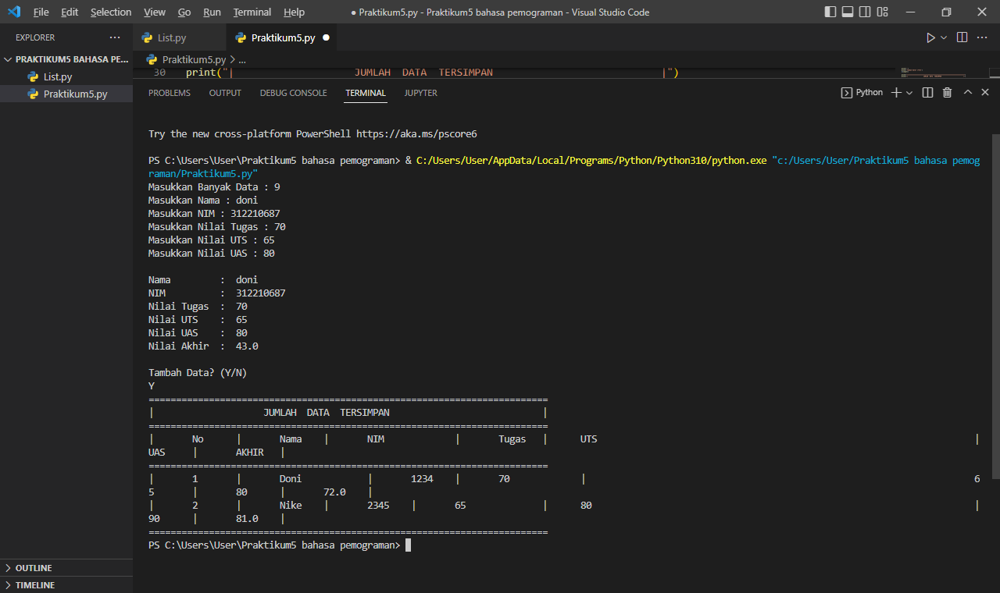

NAMA  : DONI PERDANA SIRINGORINGO
.NIM   : 312210687
.KELAS : TI.22.B1.

# Tugas Praktikum
------------------
Buat program sederhana untuk menambahkan data kedalam sebuah list dengan rincian sebagai berikut:

*1.Progam meminta memasukkan data sebanyak-banyaknya (gunakan perulangan)*
*2.Tampilkan pertanyaan untuk menambah data (y/t?), apabila jawaban t (Tidak), maka program akan menampilkan daftar datanya.*
*3.Nilai Akhir diambil dari perhitungan 3 komponen nilai (tugas: 30%, uts: 35%, uas: 35%)*
*4.Buat flowchart dan penjelasan programnya pada README.md*
*5.Commit dan push repository ke github.*

# Langkah pertama 
1. buat file bernama `list.py` dengan mengetikkan kodingan dibawah ini:


```python
# membuat list
print("Buat sebuah list sebanyak 5 elemen dengan nilai bebas")
list = [1, 2, 3, 4, 5]
print(list)

# mengakses list
print("Menampilkan elemen 3")
print(list[2])

print("ambil nilai elemen 2 sampai ke 4")
print(list[1:4])

print("ambil elemen terakhir")
print(list[-1])

# mengubah elemen list
print("ubah elemen 4 dengan nilai lainnya")
list[4]=10
print(list[3])

print("ubah elemen 4 sampai dengan elemen terakhir")
list[4:5]=[20,11]
print(list)

# Tambah elemen list
print("Ambil 2 bagian dari list pertama(A) dan jadikan list ke 2(B)")
list_pertama=list[3:5]
print(list_pertama)

print("tambah list B dengan nilai string")
list_pertama.append("guest")
print(list_pertama)

print("Tambah list B dengan 3 nilai")
list_pertama.append(["guest",7,8])
print(list_pertama)

print("Menggabungkan list B dengan list A")
gabung=list_pertama+list
print(gabung)
```
# Haisil Kodingan


# langkah kedua

1. buatlah file dengan nama `praktikum5.py`
2. dengan mengetikkan kodingan berikut ini:

```python
list_nama = []
list_nim = []
list_tugas = []
list_uts =[]
list_uas = []
list_akhir = []

data = int(input("Masukkan Banyak Data : "))
nama = input("Masukkan Nama : ")
nim = input("Masukkan NIM : ")
tugas = input("Masukkan Nilai Tugas : ")
uts = input("Masukkan Nilai UTS : ")
uas = input("Masukkan Nilai UAS : ")

print('')
akhir = (int(tugas)* .2) + (int(uts)* .4) + (int(uas)* .4)

print("Nama         : ",nama)
print("NIM          : ",nim)
print("Nilai Tugas  : ",tugas)
print("Nilai UTS    : ",uts)
print("Nilai UAS    : ",uas)
print("Nilai Akhir  : ",akhir)

print('')
print('Tambah Data? (Y/N)')
x=input()

print("=========================================================================")
print("|                    JUMLAH  DATA  TERSIMPAN                            |")
print("=========================================================================")
print("|\tNo\t|\tNama\t|\tNIM\t\t|\tTugas\t|\tUTS\t|\tUAS\t|\tAKHIR\t|")
print("=========================================================================")
print("|\t1\t|\tAri\t\t|\t1234\t|\t70\t\t|\t65\t|\t80\t|\t72.0\t|")
print("|\t2\t|\tBambang\t|\t2345\t|\t65\t\t|\t80\t|\t90\t|\t81.0\t|")
print("=========================================================================")
```
# Hasil koding



# Berikut Flowchart yang akan kita buat:


# TERIMAKASIH
